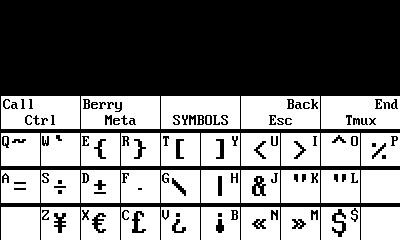
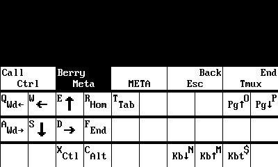

# Beepy Symbol Overlay

## User Guide

This is a helper utility to display a visual keymap on top of the Beepy display content. It relies on custom overlay features of the `sharp-drm` Beepy display driver package, so it only works directly on the Beepy device. It is not intended to be ran directly in normal usage. Instead, the Beepy keyboard driver will use this utility to display the overlay.

### Symbol Entry Overlay



Pressing the Sym key once will apply the AltGr modifier to the next alpha keypress. The default Beepy keymap maps AltGr and alpha key combinations to commonly used symbols. While in Symbol entry mode, a "S" indicator will appear at the top-right of the screen.

Holding the Sym key for more than one second will both enable Symbol entry mode, and open this symbol overlay utility and provide a visual keymap. The top row of keys, listing the Call, Berry, Back, and End Call keys, are not specific to Meta mode, but are a reference to the constantly mapped function keys. The bottom rows of keys detail the symbols each alpha key will map to. Pressing the Back key will exit Symbol entry mode.

### Meta Mode Overlay



Pressing the Berry key once will enter "Meta" mode, a shortcut mode that remaps the physical alpha keys to shortcuts and cursor movement keys such as arrow keys, Home, and End. While in Meta mode, a Star indicator will appear at the top-right of the screen.

Similar to symbol entry mode, holding the Berry key for more than one second will both enable Meta mode, and open this symbol overlay utility and provide a visual keymap for Meta mode functions. Pressing the Back key will exit Meta mode. For more information on Meta mode keymappings, see [documentation for the Beepy keyboard driver](https://github.com/ardangelo/beepberry-keyboard-driver#meta-mode).

## Developer Reference

Utility arguments:

```
usage: symbol-overlay sharp_dev [--clear-all] [--meta] [--keymap=<path>] sharp_dev
sharp_dev    Sharp device to command (e.g. /dev/dri/card0)
--clear-all  Clear all overlays and exit
--meta       Display Meta mode keymap instead of Symbol keymap
--keymap     Path to X11 keymap to show for Symbol
  (default /usr/share/kbd/keymaps/beepy-kbd.map)
```

Building SDL2 test utility:

```
make symbol-overlay-test
./symbol-overlay-test /path/to/beepy-kbd.map .
./symbol-overlay-test --meta .
```

Regenerating X11 keymap:

```
git clone git@github.com:xkbcommon/libxkbcommon.git
g++ x11map.cpp -Ilibxkbcommon/include/ -Llibxkbcommon/build -lxkbcommon $(pkg-config --cflags --libs x11) -o x11map
./x11map > src/x11name_to_utf16.cpp
```
