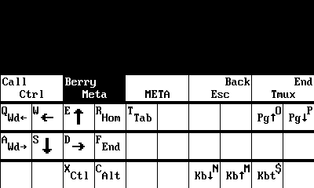

# Beepy Quick Start

- [Hardware setup](#hardware-setup)
- [Create a bootable SD card](#create-a-bootable-sd-card)
- [Flashing firmware](#flashing-firmware)
- [Pre-boot setup](#preboot-setup)
- [First-boot setup](#firstboot-setup)
  - [Initial user account configuration](#initial-user-account-configuration)
  - [Idle service configuration](#idle-service-configuration)
  - [Wireless network configuration](#wireless-network-configuration)
- [Applications and services](#applications-and-services)

## Hardware setup

If you are installing your own Raspberry Pi Zero or any other SBC, make sure all the mounting pins are properly aligned to each hole before tightening the screws. **If you cannot see the pin through a header hole, then it is not properly mounted.** Move the board around until all the pins "click" into place. Skip this step if the Pi is already pre-installed.

The USB-C port at the bottom powers and charges the Beepy. **Do not power the Raspberry Pi Zero through its Micro-USB port (PWR IN).**

## Create a bootable SD card

Beepy Raspbian is a customized version of Raspbian, the official Debian distribution for the Raspberry Pi. Beepy Raspbian is an all-in-one image for Beepy, with device drivers, optimizations, and OS services preinstalled and configured for you.

Once you install Beepy Raspbian, you can manage your Beepy just like a normal Debian Linux device.

Download the latest release of the Beepy Raspbian distribution here: <https://github.com/ardangelo/beepy-gen/releases/>. Unzip the image to obtain an image file `sdcard.img`. Use your disk imager of choice to flash the entire image to a microSD card.

* Mac OS / Linux: `sudo dd if=2024-04-23-Beepy.img of=/dev/sdX`
* Windows: [Rufus disk imaging tool](https://rufus.ie/en/)

## Flashing firmware

If you're setting up a new Beepy device, it's recommended to flash the firmware directly from the latest firmware release. After your Beepy is set up, you can apply future firmware updates on-device using a simple utility.

1. [Download the latest firmware image](https://github.com/ardangelo/beepberry-rp2040/releases/latest/download/i2c_puppet.uf2)

2. Turn the power switch off. With the device facing up, slide the power switch in the bottom-left hand corner to the left.

3. Connect the Beepy to your computer via USB-C.

4. Locate the "End Call" key. It is the rightmost key on the top row of four function keys. 

5. While holding the "End Call" key, slide the power switch back on to enter firmware flash mode. In firmware flash mode, the LED will light up, and the Beepy will present itself as a USB mass storage device on your computer.

7. Copy the firmware image onto the presented drive just like a normal file. When copying is complete, Beepy will automatically flash and reboot with the new firmware.

More firmware configuration and update information: [Beepy Firmware](beepy-fw.html).

## Pre-boot setup

The display driver automatically adds terminal configuration lines to the Raspberry Pi `cmdline.txt` file at `/boot/firmware/cmdline.txt`. It configures the Linux framebuffer, including font size. You can edit this file from your computer by inserting the microSD card and editing the file on the boot partition at `/boot/firmware/cmdline.txt`.

The `cmdline.txt` option `fbcon=font:VGA8x8` configures a default font size of 30 rows and 50 columns. This can be changed to `font:VGA8x16` for a larger font, but you may have rendering problems with such small terminal dimensions. More fonts and options for the `fbcon` module can be found at <https://www.kernel.org/doc/Documentation/fb/fbcon.txt>.

## First-boot setup

Insert the microSD card into the Raspberry Pi, and insert a USB-C cable into the Beepy's charge port to keep it charged during setup. Turn the power switch on. With the device facing up, slide the power switch in the bottom-left hand corner to the right.

The screen will turn on, but display static. The notification LED in the top-left hand corner will turn solid green. This will continue for about 20 seconds, depending on the speed of your microSD card. During this first boot, Raspbian is resizing the main partition to fill the free space on the card.

Once the display driver is configured, you will see scrolling white-on-black text on the screen, and the notification LED will turn off. Beepy will reboot again, this time to a series of dialogs.

### Initial user account configuration

The first dialog configures the default account's username and password.

Due to the limited number of keys, there are different shortcuts and modes mapped by the keyboard driver. For a full explanation on key mapping, see the [Beepy keyboard user guide](beepy-kbd.html#user-guide).

Basic key mapping summary,

> The alternate symbols printed directly on the keys are sent by pressing the `Physical Alt` key on the bottom left corner of the keyboard, then pressing the key on which the desired symbol is printed. While `Physical Alt` is active, you will see an `a` indicator in the top right corner of the screen: . The combination `Physical Alt` + `Enter` is also mapped to `Tab`. `Physical Alt` is a "[sticky modifier key](beepy-kbd.html#sticky-modifier-keys)".

> For additional symbols not printed directly on the keys, use the `Symbol` key on the bottom row of the keyboard. While `Symbol` is active, you will see an `S` indicator in the top right of the screen: . Internally, `Symbol` sends AltGr (Right Alt), which is mapped to more symbols via the keymap file at `/usr/share/kbd/keymaps/beepy-kbd.map`. `Symbol` is a "[sticky modifier key](beepy-kbd.html#sticky-modifier-keys)". You can view the Symbol key map by holding the `Symbol` key for 1 second. Modifying the keymap file will also update the Symbol key map displayed; below is the default key map:

> 

> From left to right, the top row of the Beepy keyboard has the following keys:

> * "Call", a phone facing up.
>    * Single click: Enter Control key ([sticky modifier](beepy-kbd.html#sticky-modifier-keys)).
>    * Short hold: Lock Control key ([sticky modifier](beepy-kbd.html#sticky-modifier-keys)).
> * "Berry": a collection of sections shaped like a fruit.
>    * Single click: Enter [Meta mode](beepy-kbd.html#meta-mode).
>    * Short hold (1s): Display [Meta mode reference overlay](beepy-kbd.html#meta-mode).
> * "Touchpad": pressing the touchpad sensor will click and produce a key event.
>     * Single click: by default, enable [touchpad mode](beepy-kbd.html#touchpad-mode), sending arrow keys. If touchpad mode is already on, a single click will send `Enter`.
> * "Back": an arrow looping back onto itself.
>     * Single click: send `Escape`. Commonly used to exit menus in utilities.
> * "End Call": a phone facing down, with a line underneath.
>     * Single click: Send the [tmux prefix](beepy-tmux-menus.html). Prefix is [configurable in the driver keymap](beepy-kbd.html#custom-keymaps).
>     * Short hold (1s): Open the [tmux menu](beepy-tmux-menus.html). If the Pi has been shut down, a short hold will turn the Pi back on.
>     * Long hold (5s): send a shutdown signal to the Pi.

Meta mode summary,

> Meta mode is a modal layer that assists in rapidly moving the cursor and scrolling with single keypresses. To enter Meta mode, click the `Berry` key once. The Meta mode indicator  will appear in the top right corner of the screen.

> You can view the Meta mode key map by holding the `Berry` key for 1 second:

> 

Touchpad summary,

> Press the touchpad itself to turn on touchpad mode, and start sending arrow keys when you move your finger across the touchpad. While active, you will see the touchpad indicator  in the top-right corner of the screen.

> Clicking the touchpad itself again while the touchpad is active will send `Enter`. Pressing the `Back` key will exit touchpad mode.

> You can also hold the `Shift` key to temporarily turn on the touchpad until the `Shift` key is released. You will see the Shift indicator  instead of the touch indicator.

> If you release the `Shift` key *without* using the touchpad, you will instead get the [sticky modifier behavior](#sticky-modifier-keys) of applying Shift to the next alpha keypress. In this case, the Shift indicator will remain on the screen. Press and release the `Shift` key again to un-stick the modifier and hide the indicator.

### Idle service configuration

Next, you will be presented with an option to either enable or disable the `beepy-idle` service. Press `Alt + Enter` to switch between `Yes` and `No` options.

If enabled, this service will automatically shut down the Pi and deep sleep the RP2040 controller to preserve battery life.

The Pi will not shut down unless it has been 5 minutes since the last keypress, or if Tmux is running an active foreground process.

The timeout and allowed processes can be configured by editing the file at `/etc/beepy-idle.conf`. By default, if Tmux is running any process other than `bash` or `gomuks`, idle will be inhibited.

More information: [`beepy-idle` service](beepy-poll.html#beepy-idle)

### Wireless network configuration

Two informational message boxes will be displayed with quick summaries on how to enter symbols and input arrow keys. For a more complete explanation than can be fit in a small message box, see the [Beepy keyboard user guide](beepy-kbd.html#user-guide).

`nmtui` will open to configure a wireless network. `nmtui` is a text-based configuration program for the NetworkManager service. Use the up and down arrow keys (accessible using [Meta mode](beepy-kbd.html#meta-mode) or with the [touhcpad](beepy-kbd.html#touchpad-mode)) to move between networks, and `Enter` to select a network to connect to. After a connection is established, press the `Back` key (mapped to `Escape`) to exit `nmtui`.

## Applications and services

At this point, initial setup is completed.

Driver guides and configuration:

* [beepy-kbd](beepy-kbd.html): Keyboard driver and firmware interface
* [sharp-drm](sharp-drm.html): Display driver and console font configuration
* [beepy-fw](beepy-fw.html): Device firmware, updating and configuration

Preinstalled Beepy software:

* [beepy-gomuks](beepy-gomuks.html): Gomuks Beeper client customized for Beepy
* [beepy-tmux-menus](beepy-tmux-menus.html): Tmux plugin for visually managing Tmux
* [beepy-poll](beepy-poll.html): OS service to wake up and run polling scripts

Documentation for these packages is also available in manpage format on-device. Run `man package` e.g. `man beepy-kbd` for keyboard documentation.

## Beepy Discord

[Discord Invite](https://discord.gg/QERrSferdF)

### Matrix Bridge

[#beepy-general](https://matrix.to/#/#beepberry-general:beeper.com)

[#beepy-dev](https://matrix.to/#/#beepberry-dev:beeper.com)

[#beepy-apps](https://matrix.to/#/#beepberry-apps:beeper.com)

[#beepy-hw](https://matrix.to/#/#beepberry-hw:beeper.com)
